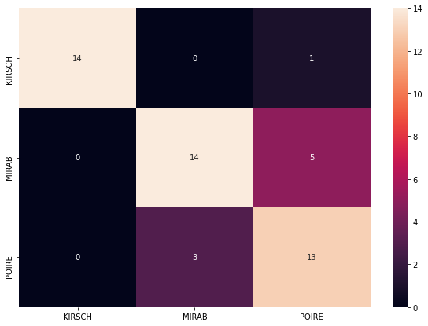

# Linear Discriminant Analysis 
The application performs linear (predictive) discriminant analysis. It was developed as a homework project for the Python programming class at the University Lumière Lyon 2 (France) in collaboration with [AbdDia](https://github.com/AbdDia), [Valinquish](https://github.com/Valinquish) and [ASKruchinina]( https://github.com/ASKruchinina). 
The objective of the project was to reproduce the calculations and the outputs similar to the SAS [DISCRIM]( https://support.sas.com/documentation/cdl/en/statug/63962/HTML/default/viewer.htm#statug_discrim_sect001.htm) and [STEPDISC]( https://support.sas.com/documentation/cdl/en/statug/63962/HTML/default/viewer.htm#statug_stepdisc_sect001.htm) procedures.

The program calculates the discriminant functions, predicts classes for the new data; confusion matrix as well as accuracy score can be measured after the predictions are done. Users can perform the selection of the variables choosing forward or backward methods. Reports with the results are available in HTML or PDF formats.

This application consists of 3 modules: `discriminant_analysis.py`, `calculations.py`, `reporting.py`.
You can find a demonstration in `demo_program.py` with the training data in the `data` folder.

## Application
After importing the necessary libraries:
```python
import pandas as pd
from discriminant_analysis import LinearDiscriminantAnalysis as LDA
from reporting import HTML, PDF
```

you can start by creating an instance from the `LinearDiscriminantAnalysis` class by specifying two parameters (the training dataset itself and the name of the target column).

```python
lda = LDA(dataset, TargetName)
```
Below you can find the list of the attributes and methods of that class.

### Attributes:
*	'classEtiquette': name of the target column
*	'classNames': unique labels of the target value
*	'dataset': full training data (incl. target)
*	'K': number of unique classes/target values
*	'n': number of training observations
*	'p': number of explicative variables
*	'varNames': list of explicative variables
*	'V': total covariance matrix
*	'Vb': biased total covariance matrix
*	'W': intra-classe covariance matrix
*	'Wb': biased intra-classe covariance matrix
     
### Methods     
*	'accuracy_score': accuracy score for the predictions
*	'confusion_matrix': confusuon matrix for the predictions
*	'fit': matrix of intercept and coefficients
*	'predict': list of predicted classes
*	'stepdisc': stepwise discriminant analysis
*	'wilks_decay': values of Wilks' Lambda, the curve of its' decay

For example, to display number of unique target values and its’ names:
```python
print('Number of classes: ', lda.K, ' and their unique values: ', lda.classNames) 

#output:  Number of classes:  3 and their unique values:  ['KIRSCH', 'MIRAB', 'POIRE']
```

## Discriminant functions
In order to get the intercept and coefficients of the discriminant functions you need to call `fit()`:

```python
lda.fit()
```

### Attributes:
* `intercept_`: the intercept of the model
* `coef_`: the coefficients of the model
* `infoFuncClassification`: the values of the classification function (intercept and coef. united in one matrix)

## Predictions
`predict()` allows to make predictions for a new data and returns a vector of the predicted classes.

```python
y_pred = lda.predict(values_to_predict)
```

## Confusion matrix and accuracy score
In order to measure how well or efficiently the model has predicted, you can compute the confusion matrix and the accuracy score. 
The method `confusion_matrix()` "provides an unbiased assessment of the model's performance in deployment". It takes the vector of true values of the target variable that were not used during the training and the vector of predicted values. Thus, **one can estimate whether the function is capable to make good predictions**. 
The confusion matrix is presented with the help of *seaborn* library which facilitates the comprehension/readability.

The method `accuracy_score()`takes as input the true values of the target variable and the predicted ones and returns the proportion of the correct predictions. The formula is classical: (TP + TN) / (P + N).

We did not implement other scores due to time constraints and other priorities, but the user can easily calculate other metrics as he/she wishes with the help of the *confusion matrix*.

```python
lda.confusion_matrix(y_true, y_pred)
lda.accuracy_score(y_true, y_pred)
```



## Variable selection (Stepwise Discriminant Analysis)
The method `stepdisc()` allows to realize a stepwise discriminant analysis. You need to precise the method (**a `forward` approach** or **a `backward` approach**) and the stopping threshold (risk) as the parameters.

```python
# Example of a forward selection method
lda.stepdisc(0.01, 'forward') 
```

### Attributes:
* `infoStepResults`: displays the different values for the last step
* `stepdiscSummary`: summary of the variable selection approach

## Wilks decay curve
The function `wilks_decay()` calculates the value of Wilks' lambda as a function of the number of the selected explicative variables and displays the curve of the Wilks' lambda decay. For example, if there are 40 explanatory variables, the lambda values will be for {1, 2, ..., 40}.
 
```python
lda.wilks_decay()
lda.figWilksDecay 
```
### Attributes:
* `infoWilksDecay`: list of Wilks’ Lambda values according to the number of selected variables
* `figWilksDecay`: Wilks’ Lambda decay curve

## Reporting
### Discriminant functions (`fit()`)
Provides output similar to [SAS PROC DISCRIM](https://support.sas.com/documentation/cdl/en/statug/63962/HTML/default/viewer.htm#statug_discrim_sect029.htm), in HTML or PDF format. Preliminary you need to import the `reporting' module.

```python
HTML().discrim_html_output(lda, outputFileName.html)
PDF().discrim_pdf_output(lda, outputFileName.pdf)
```

### Variable selection (`stepdisc()`)
Provides output similar to [SAS PROC STEPDISC](https://support.sas.com/documentation/cdl/en/statug/63962/HTML/default/viewer.htm#statug_stepdisc_sect017.htm), in HTML format.
```python
HTML().stepdisc_html_output(lda, outputFileName.html)
```

### Stay calm and do LDA! :dancer:

If you have any comments or feedback, please feel free to contact me. 

Cheers

# References
1. Hastie T., Tibshirani R., Friedman J. (2008). “The Elements of Statistical Learning”, Section 4.3, p.106-119, 2008.
2. James, G., Witten, D., Hastie, T., & Tibshirani, R. (2013). An Introduction to Statistical Learning : with Applications in R (Springer Texts in Statistics) (1st ed. 2013, Corr. 7th printing 2017 éd.). Springer.
3. Ricco Rakotomalala. [Cours Analyse Discriminante](http://eric.univ-lyon2.fr/%7Ericco/cours/cours_analyse_discriminante.html).
4. Ricco Rakotomalala. (2020). [Analyse Discriminante Linéaire sous R](http://eric.univ-lyon2.fr/~ricco/tanagra/fichiers/fr_Tanagra_LDA_MASS_R.pdf).
5. Ricco Rakotomalala. (2020). [Pratique de l’Analyse Discriminante Linéaire](http://eric.univ-lyon2.fr/~ricco/cours/cours/Pratique_Analyse_Discriminante_Lineaire.pdf).
